<div align="center">


<br/>

[](https://git.io/typing-svg)

<br/>


</div>

---

## 🌍 About The Project

**AI Travel Planner** is a full-stack **Agentic AI** application that turns your trip idea into a complete, personalized itinerary — automatically.

Instead of one AI answering everything, this app uses a **team of AI agents** that talk to each other:

- 🧭 **Planner Agent** — builds your day-by-day itinerary
- 💰 **Budget Agent** — checks and optimizes your spending
- 🔍 **Reflection Agent** — reviews and improves the final plan

### Why this project?

Planning a trip usually means 10 open tabs, spreadsheets, and stress. This project solves that by giving you **one AI-powered dashboard** for the whole journey — from destination research to budget breakdown.

### Who is it for?

- 🧳 Travelers who want a fast, smart itinerary
- 👩‍💻 Developers learning **multi-agent AI systems**
- 🎓 Students exploring **CrewAI + FastAPI + React** in a real project

---

## 📸 Project Preview

| Landing Page | Dashboard |
|:---:|:---:|
| 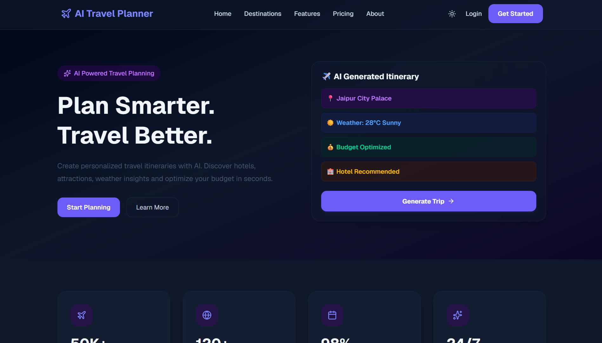 | 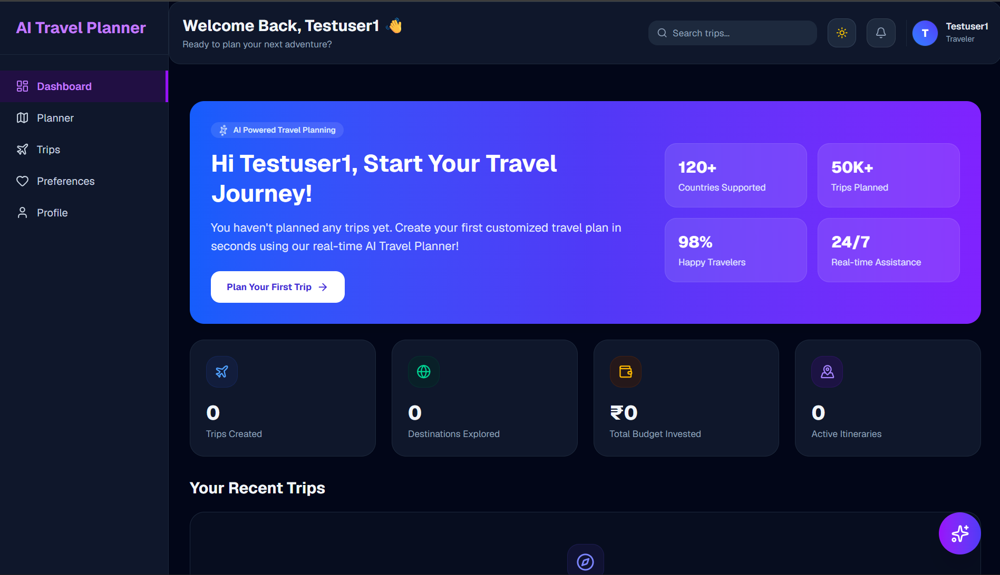 |

| Login | Register |
|:---:|:---:|
| 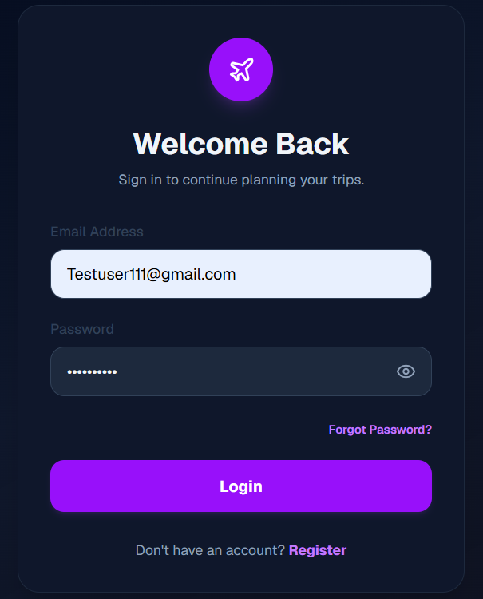 | 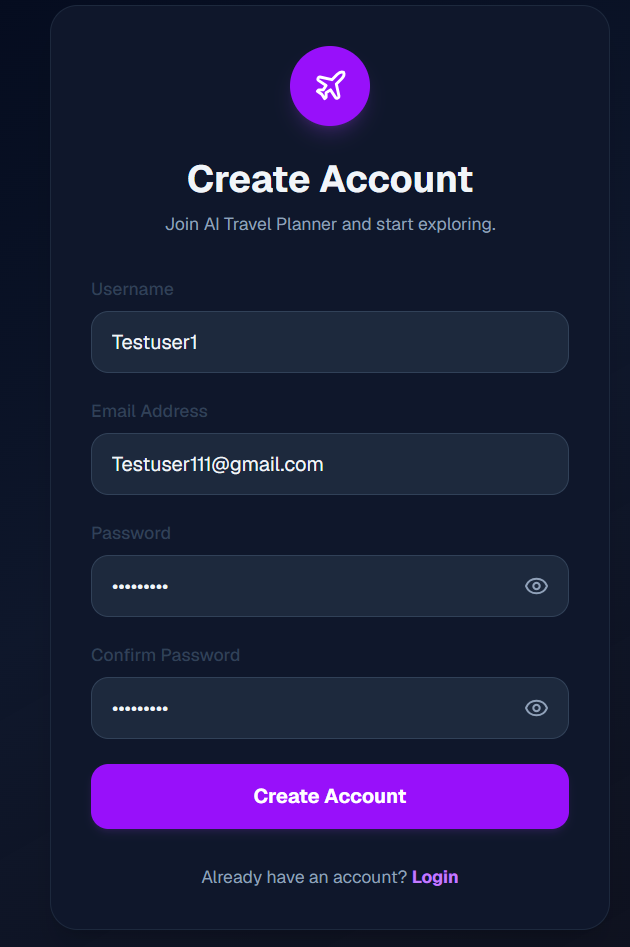 |

| AI Planner (Input) | AI Planner (Result) |
|:---:|:---:|
| 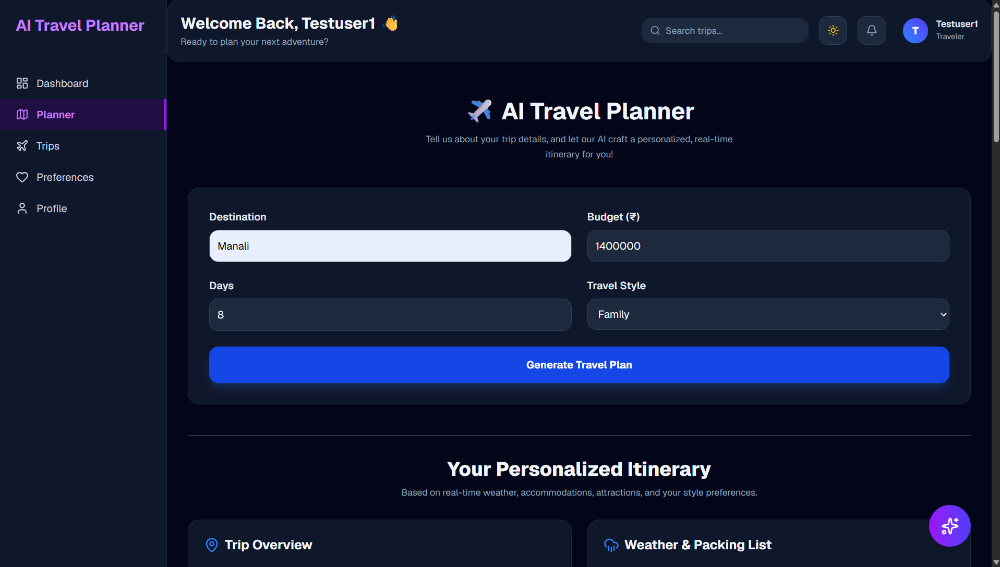 | 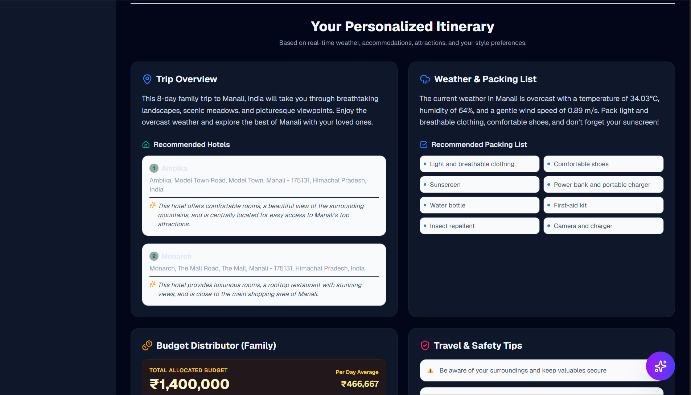 |

| Day-by-Day Itinerary | Preferences |
|:---:|:---:|
| 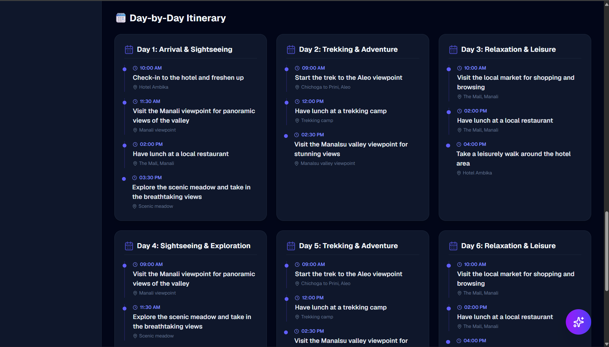 | 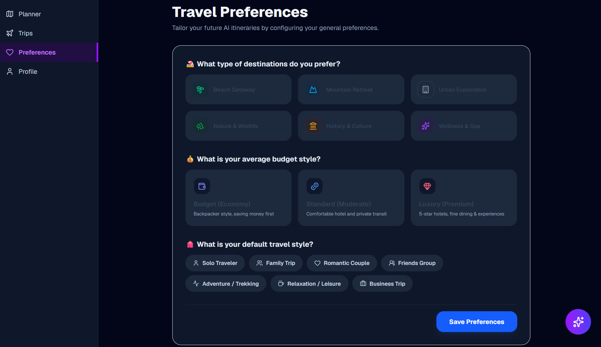 |

| Profile |
|:---:|
| 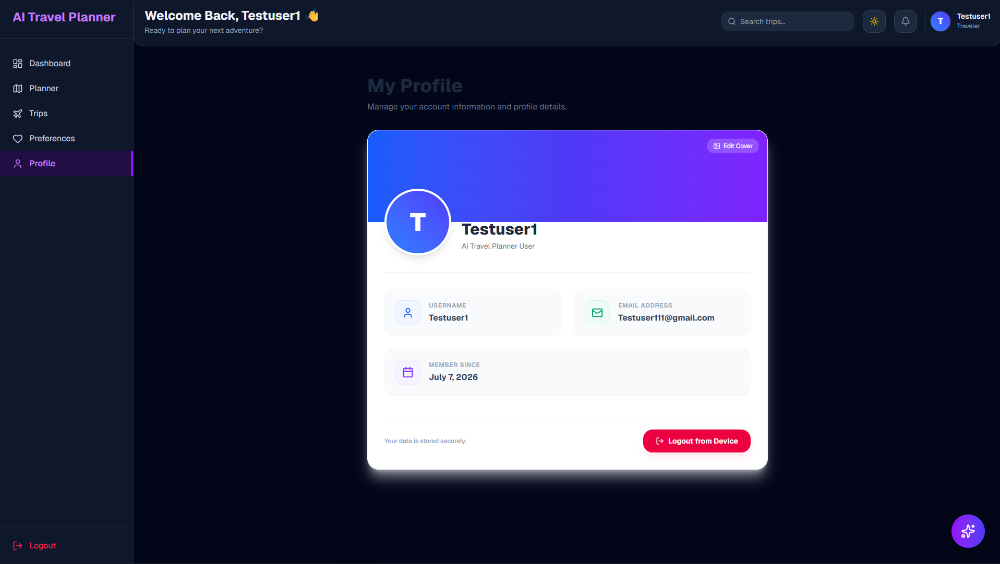 |

---

## 🎬 Demo

<div align="center">
  
</div>

---

## 🏗️ Architecture

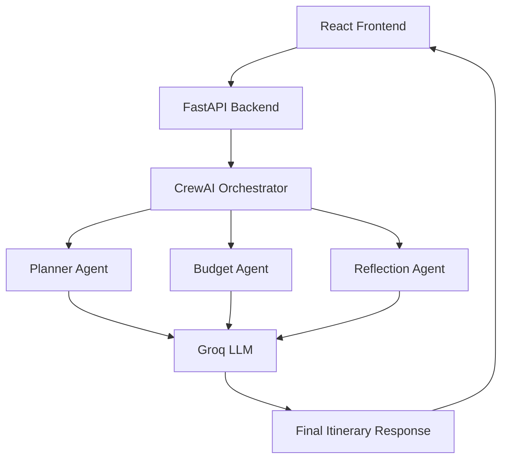

---

## 🤖 Multi-Agent Workflow

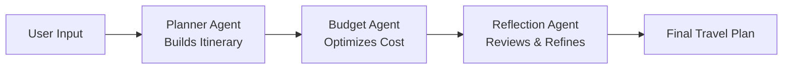

Each agent has one job. They pass results forward — like a relay race — so the final plan is accurate, budget-aware, and polished.

---

## 📂 Folder Structure

```
ai-travel-planner/
├── backend/
│   ├── app/
│   │   ├── agents/
│   │   │   ├── planner_agent.py
│   │   │   ├── budget_agent.py
│   │   │   └── reflection_agent.py
│   │   ├── tools/
│   │   │   ├── weather_tool.py
│   │   │   └── budget_calculator.py
│   │   ├── models/
│   │   ├── routes/
│   │   │   ├── auth.py
│   │   │   ├── trips.py
│   │   │   ├── preferences.py
│   │   │   └── ai.py
│   │   ├── core/
│   │   │   ├── config.py
│   │   │   └── security.py
│   │   ├── database.py
│   │   └── main.py
│   ├── requirements.txt
│   └── .env.example
│
├── frontend/
│   ├── src/
│   │   ├── components/
│   │   ├── pages/
│   │   ├── hooks/
│   │   ├── lib/
│   │   ├── App.jsx
│   │   └── main.jsx
│   ├── package.json
│   └── vite.config.js
│
├── screenshots/
├── demo/
└── README.md
```

---

## ⚙️ Installation

### 1. Clone the repository
```bash
git clone https://github.com/himanshichouhan25/ai-travel-planner.git
cd ai-travel-planner
```

### 2. Backend Setup
```bash
cd backend
python -m venv venv
venv\Scripts\activate      # Windows
source venv/bin/activate   # macOS/Linux

pip install -r requirements.txt
```

### 3. Configure Environment
```bash
cp .env.example .env
# Fill in your keys (see table below)
```

### 4. Run Backend
```bash
uvicorn app.main:app --reload
```

### 5. Frontend Setup
```bash
cd ../frontend
npm install
npm run dev
```

---

## 🔑 Environment Variables

| Variable | Description |
|---|---|
| `DATABASE_URL` | Database connection string |
| `SECRET_KEY` | JWT signing secret |
| `GROQ_API_KEY` | Groq LLM API key |
| `MODEL_NAME` | Groq model name (e.g. llama-3.3-70b) |
| `WEATHER_API_KEY` | Weather API key |
| `WEATHER_BASE_URL` | Weather API base URL |
| `ACCESS_TOKEN_EXPIRE_MINUTES` | JWT token expiry time |

---

## 🔌 API Endpoints

### Authentication
| Method | Endpoint | Description |
|---|---|---|
| POST | `/auth/register` | Register a new user |
| POST | `/auth/login` | Login and get JWT token |
| GET | `/auth/me` | Get current user profile |

### Trips
| Method | Endpoint | Description |
|---|---|---|
| GET | `/trips/` | Get all trips |
| POST | `/trips/` | Create a new trip |
| GET | `/trips/{id}` | Get trip details |
| DELETE | `/trips/{id}` | Delete a trip |

### Preferences
| Method | Endpoint | Description |
|---|---|---|
| GET | `/preferences/` | Get saved preferences |
| PUT | `/preferences/` | Update preferences |

### AI
| Method | Endpoint | Description |
|---|---|---|
| POST | `/ai/generate-plan` | Generate AI travel itinerary |
| GET | `/ai/weather/{city}` | Get weather for destination |
| POST | `/ai/budget` | Get budget breakdown |

---

## 🛠️ Tech Stack

<table align="center">
<tr>
<td valign="top" width="25%">

**Frontend**
- React.js
- Vite
- Tailwind CSS
- Shadcn UI
- Axios
- React Router
- React Hook Form
- Zod

</td>
<td valign="top" width="25%">

**Backend**
- FastAPI
- SQLAlchemy
- SQLite
- JWT Auth
- OAuth2
- Passlib
- Pydantic

</td>
<td valign="top" width="25%">

**AI Layer**
- CrewAI
- Groq LLM
- Multi-Agent System

</td>
<td valign="top" width="25%">

**Agents & Tools**
- Planner Agent
- Budget Agent
- Reflection Agent
- Weather Tool
- Budget Calculator

</td>
</tr>
</table>

---

## ✨ Features

| | | |
|---|---|---|
| 🧭 AI Trip Planning | 🔐 Secure JWT Login | 📊 Dashboard |
| 📜 Trip History | 💰 Budget Planning | 🌦️ Weather Info |
| ⚙️ Preference Management | 🤖 Agentic AI Workflow | ⚡ FastAPI Backend |
| 🎨 Modern React UI | 📱 Responsive Design | 🧱 Clean Architecture |
| 🧠 Memory Ready | 🔌 Extensible Multi-Agent Design | 🚀 Production Ready |

---

## 🗺️ Roadmap

- [ ] ✈️ Flight API Integration
- [ ] 🗺️ Google Maps Integration
- [ ] 🏨 Hotel Booking API
- [ ] 💬 AI Chat Assistant
- [ ] 🎙️ Voice Assistant
- [ ] 💱 Currency Conversion
- [ ] 📄 PDF Export
- [ ] 🔗 Trip Sharing
- [ ] 📧 Email Itinerary
- [ ] 🔔 Notifications
- [ ] 🌙 Dark Mode Improvements
- [ ] 🐳 Docker Deployment
- [ ] 🧵 Redis Caching
- [ ] 🐘 PostgreSQL Migration
- [ ] 🔁 CI/CD Pipeline

---

## 📈 GitHub Stats

<div align="center">


</div>

---

## 🤝 Contributing

Contributions make open source great! Here's how:

1. Fork the repository
2. Create a branch: `git checkout -b feature/AmazingFeature`
3. Commit changes: `git commit -m 'Add AmazingFeature'`
4. Push: `git push origin feature/AmazingFeature`
5. Open a Pull Request

---

## 📄 License

Distributed under the **MIT License**. See `LICENSE` for details.

---

## 📬 Contact

<div align="center">

[](https://github.com/himanshichouhan25)
[](#)
[](#)
[](#)

</div>

---

## ⭐ Support

If this project helped you, please consider:

- ⭐ **Starring** the repo
- 🍴 **Forking** it
- 🐛 **Reporting issues**
- 🤝 **Contributing**

---

<div align="center">


Made  by **Himanshi Chouhan**

</div>
